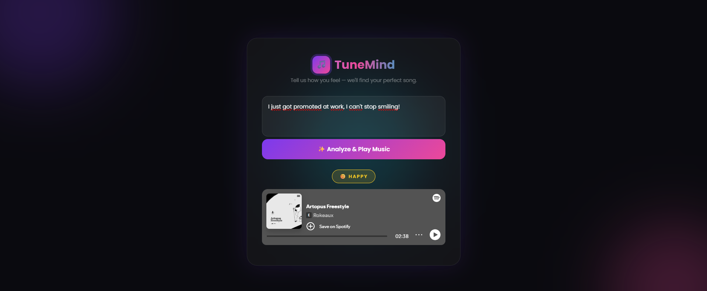
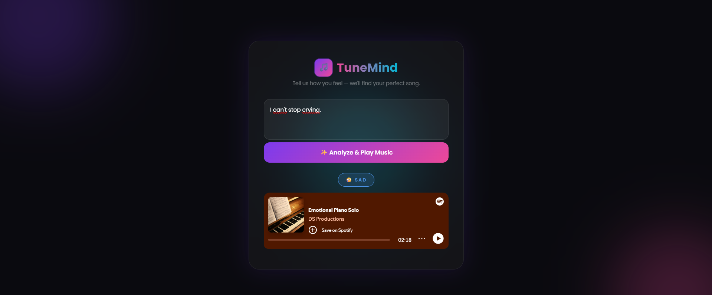
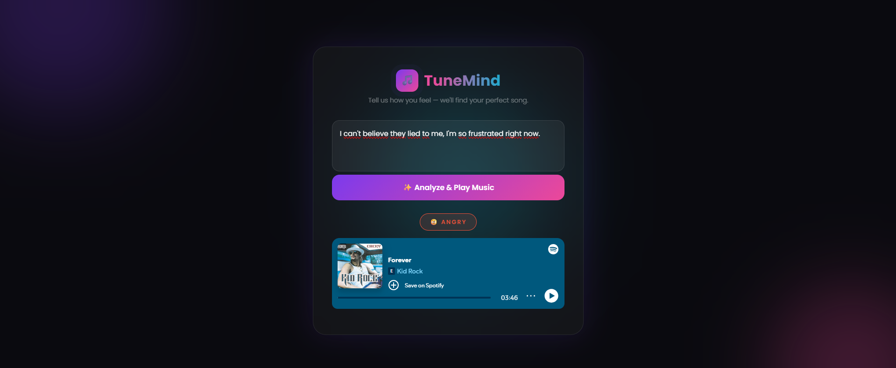
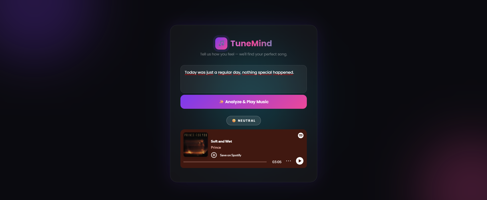

# 🎵 TuneMind - Emotion Music

TuneMind detects your emotion from text and plays a matching song from Spotify.

## Screenshots

### Main Screen


### Happy


### Sad


### Angry


### Neutral


## Technologies
- Backend: FastAPI, Python
- Emotion Detection: Hugging Face (j-hartmann/emotion-english-distilroberta-base)
- Music: Spotify API (Spotipy)
- Frontend: HTML, CSS, JavaScript

## Setup

### 1. Clone the repository
```
git clone https://github.com/60yusuf60/TuneMind.git
```

### 2. Install dependencies
```
pip install fastapi uvicorn sqlalchemy spotipy python-dotenv transformers torch
```

### 3. Create .env file inside the backend folder
```
SPOTIPY_CLIENT_ID=your_client_id
SPOTIPY_CLIENT_SECRET=your_client_secret
```

### 4. Run the backend
```
cd backend
uvicorn main:app --reload
```

### 5. Open frontend
Open `frontend/index.html` in your browser.

## How It Works
1. User types how they feel
2. Hugging Face AI model detects the emotion
3. Spotify API fetches a matching song
4. Song plays directly in the browser via Spotify Embed Player